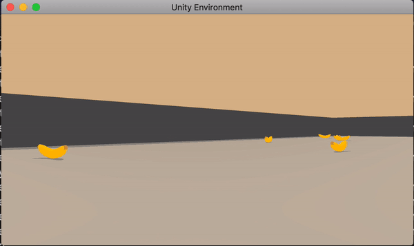
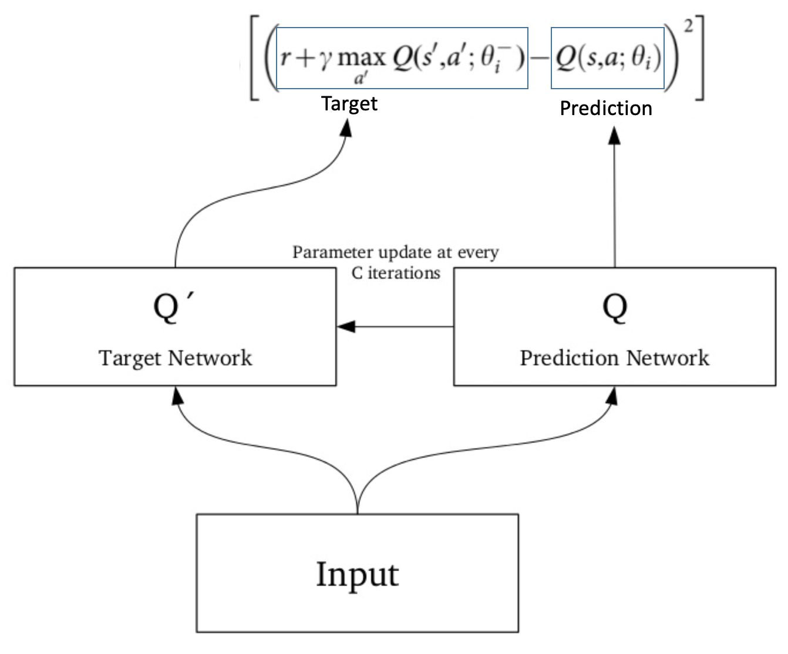
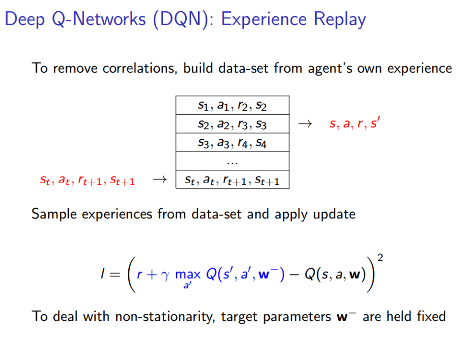
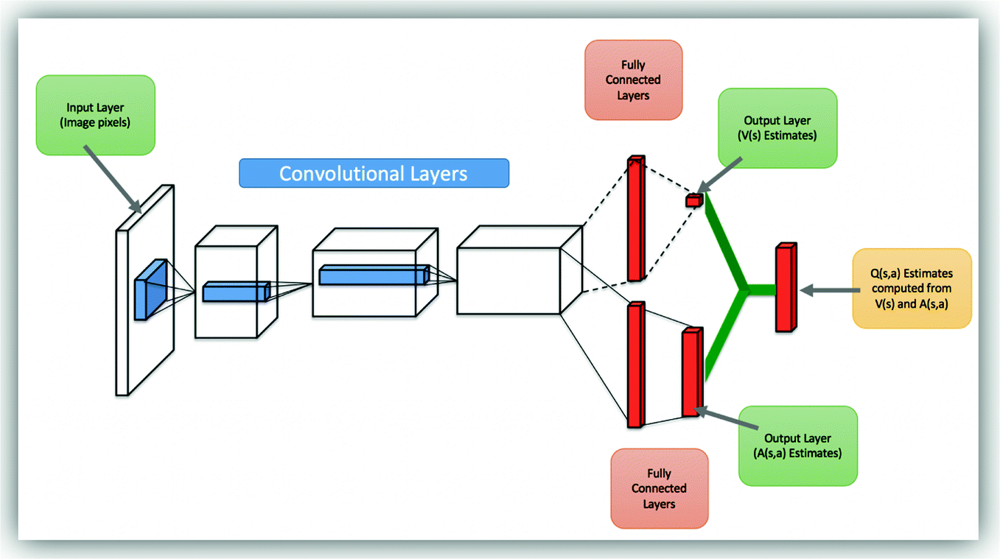
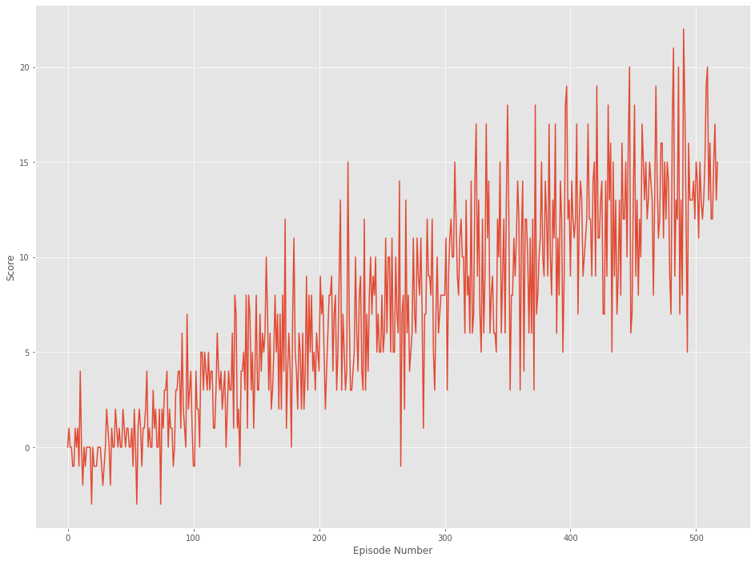
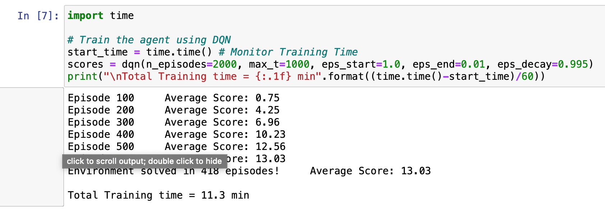
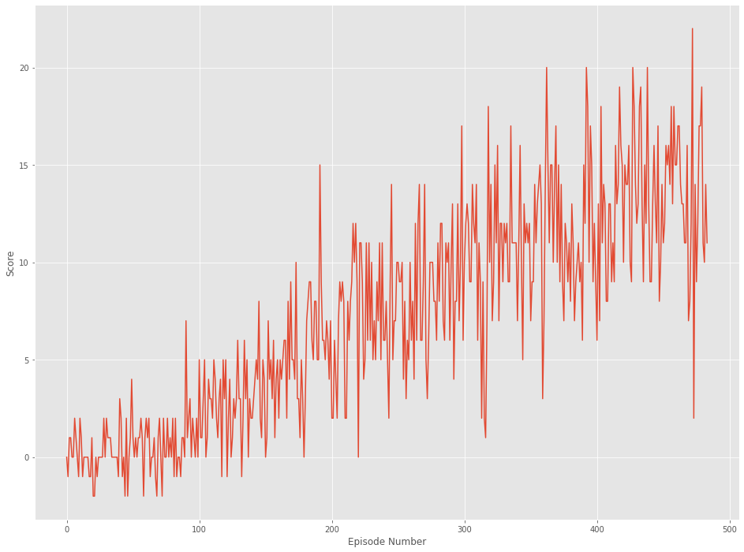
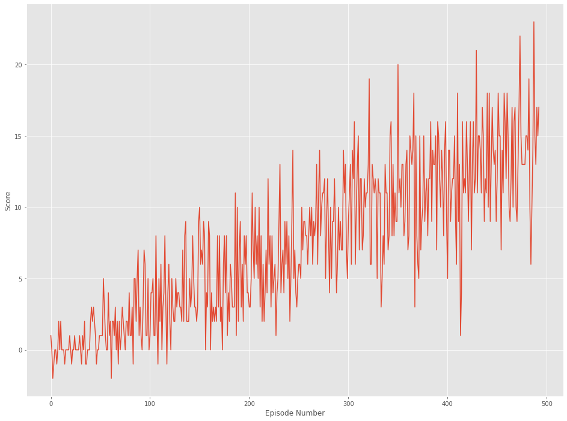

# Navigation - Minion Banana Run

## 1. Project's goal

In this project, **the goal is to train an agent to navigate a virtual world and collect as many yellow bananas as possible while avoiding blue bananas**



## 2. Environment details

The environment is based on [Unity ML-agents](https://github.com/Unity-Technologies/ml-agents)

Note: The project environment provided by Udacity is similar to, but not identical to the Banana Collector environment on the Unity ML-Agents GitHub page.

> The Unity Machine Learning Agents Toolkit (ML-Agents) is an open-source Unity plugin that enables games and simulations to serve as environments for training intelligent agents. Agents can be trained using reinforcement learning, imitation learning, neuroevolution, or other machine learning methods through a simple-to-use Python API. 

A reward of +1 is provided for collecting a yellow banana, and a reward of -1 is provided for collecting a blue banana. Thus, the goal of the agent is to collect as many yellow bananas as possible while avoiding blue bananas.

The state space has 37 dimensions and contains the agent's velocity, along with ray-based perception of objects around the agent's forward direction. 

Given this information, the agent has to learn how to best select actions. Four discrete actions are available, corresponding to:

- 0 - move forward.
- 1 - move backward.
- 2 - turn left.
- 3 - turn right.

The task is episodic, and **in order to solve the environment, the agent must get an average score of +13 over 100 consecutive episodes.**

## 3. Implementation

### 3.1.1 Deep-Q-Networks (DQN)

We have implemented the **Value Based** method that we learned in Week 2 of the course - [Deep Q-Networks](https://deepmind.com/research/dqn/).

In deep Q-learning, we use a neural network to approximate the Q-value function. The state is given as the input and the Q-value of all possible actions is generated as the output.

The steps involved in reinforcement learning using deep Q-learning networks (DQNs) as follows:

- All the past experience is stored by the user in memory
- The next action is determined by the maximum output of the Q-network
- The loss function here is mean squared error of the predicted Q-value and the target Q-value – Q*. This is basically a regression problem. However, we do not know the target or actual value here as we are dealing with a reinforcement learning problem. Going back to the Q-value update equation derived fromthe Bellman equation. we have:

    $$ Q (S(t), A(t)) = Q (S(t), A(t)) + alpha * ( R(t+1) + gamma * max Q (S(t+1), a) - Q (S(t), A(t)) ) $$


**Main Challenges in Deep RL - Non-stationary or unstable target**
RL is known to be unstable or even to diverge when a nonlinear function approximator such as a neural network is used to represent the action-value (also known as Q) function20. This instability has several causes: the correlations present in the sequence of observations, the fact that small updates to Q may significantly change the policy and therefore change the data distribution, and the correlations between the action-values and the target values .

In order to counter this challenge, we implemented the solution suggested by Deepmind. Especially, this implementation includes the 2 major training improvements by [Deepmind](https://deepmind.com) and described in their [Nature publication : "Human-level control through deep reinforcement learning (2015)"](https://storage.googleapis.com/deepmind-media/dqn/DQNNaturePaper.pdf)

- Fixed Q Targets using Target Network



- Experience Replay




### 3.1.2 Double DQN: 

DQNs are known to overestimate the value function because of the max operator. The idea of Double DQN is to disentangle the calculation of the Q-targets into finding the best action and then calculating the Q-value for that action in the given state. The trick then is to use one network to choose the best action and the other to evaluate that action. The intuition here is that if one network chose an action as the best one by mistake, chances are that the other network wouldn't have a large Q-value for the sub-optimal action. The network used for choosing the action is the online network whose parameters we want to learn and the network to evaluate that action is the target network described earlier. More details can be found in the [paper](https://arxiv.org/abs/1509.06461).

### 3.1.3 Dueling DQN



DQNs have a single output stream with the number of output nodes equal to the number of actions. But this could lead to unnecessarily estimating the value of all the actions for states for states which are clearly bad and where, choosing any action won't matter that much. So, the idea behind dueling networks is to have two output streams, with a shared feature extractor layer. One stream outputs a single scalar value denoting the value function for that state, `V(s)` while the other stream outputs the advantage function for each action in that state `A(a, s)`. The advantage function accounts for the advantage achieved for choosing action `a` . They are combined together using a special aggregrate layer:

  $$ Q (s, a) = V(s) + (A(s, a) - 1/A * mean_a (A (s, a))$$

We have implemented all three of these methods, and we can switch between each algorithm by changing the "algo_type" parameter. The Dueling DQN has a different model architecture (two-stream) and is included in model.py.

### 3.2 Policy

We have used the **GLIE (Greedy in Limit with Infinite Exploration)** policy to effectively handle the exploration vs. exploitation problem. The strategy favors exploration in the initial episodes and exploitation in later stages once the model grows in confidence.

We train using Epsilon-Greedy policy with Epsilon annealed from 1 to 0.01 with a decay of 0.995 every episode.

### 3.3 Code Details

We leverage the fact of how DQN was trained in a generalized manner irrespective of the environment. We derive the implementation from the "Lunar Lander" tutorial from the [Deep Reinforcement Learning Nanodegree](https://www.udacity.com/course/deep-reinforcement-learning-nanodegree--nd893), and adjust for being used in banana environment.

Salient points:

Important files:

- DQN_Banana_Navigation.ipynb : This Jupyter notebooks allows to launch the game environment, train the RL agent using appropriate algorithm and plot the scores obtained during the learning process.

- dqn_agent.py : Class for DQN agent and a Replay Buffer memory used by the DQN agent are defined in this file.
  - The DQN agent class is implemented, as described in the Deep Q-Learning algorithm. It provides several methods :
    - constructor : 
      - Initialize the memory buffer (*Replay Buffer*)
      - Initialize 2 instance of the Neural Network : the *target* network and the *local* network
    - step() : 
      - Allows to store a step taken by the agent (state, action, reward, next_state, done) in the Replay Buffer/Memory
      - Every 4 steps (and if their are enough samples available in the Replay Buffer), update the *target* network weights with the current weight values from the *local* network (That's part of the Fixed Q Targets technique)
    - act() which returns actions for the given state as per current policy (Note : The action selection use an Epsilon-greedy selection so that to balance between *exploration* and *exploitation* for the Q Learning)
    - learn() which update the Neural Network value parameters using given batch of experiences from the Replay Buffer. 
    - soft_update() is called by learn() to softly updates the value from the *target* Neural Network from the *local* network weights (That's part of the Fixed Q Targets technique)
  - The ReplayBuffer class implements a fixed-size buffer to store experience tuples  (state, action, reward, next_state, done) 
    - add() allows to add an experience step to the memory
    - sample() allows to randomly sample a batch of experience steps for the learning       

- model.py : PyTorch QNetwork class definition here. We use a regular fully connected Deep Neural Network using the [PyTorch Framework](https://pytorch.org/docs/0.4.0/). The deep learning model is trained to predict the action to perform depending on the environment observed states. 
    - Model architecture details :
      - the input layer which size depends of the state_size parameter passed in the constructor
      - 2 hidden fully connected layers of 64 cells each
      - the output layer which size depends of the action_size parameter passed in the constructor
      - We use Adam optimizer (learning rate LR=5e-4) for training the Neural network with a BATCH_SIZE=64

### 3.4 Hyperparameters

The DQN agent uses the following parameter values:

```
BUFFER_SIZE = int(1e5)  # replay buffer size
BATCH_SIZE = 64         # minibatch size 
GAMMA = 0.99            # discount factor 
TAU = 1e-3              # for soft update of target parameters
LR = 5e-4               # learning rate 
UPDATE_EVERY = 4        # how often to update the network
```

## 4. Results

The agent is allowed to train over 2000 episodes and cumulative reward per episode is calculated. The environment is considered to be solved when the average reward over past 100 episodes reaches > 13.

Post training we plot the rewards per episode to understand the training phase of the agent.

- Scores plot

**1. DQN **



We were able to solve the environment in 418 episodes!




**2. Double DQN **



We were able to solve the environment in 446 episodes!

**3. Dueling DQN **



We were able to solve the environment in 393 episodes!


## 5. Future Work

- **Prioritized Replay**: Supposedly showed great improvement over Double DQN performance for Atari games. 

- **Improving DQN**: 

We learned in this week's lectures extensions to DQN such as **multi-step bootstrap targets , Distributional DQN, Noisy DQN** that potentially improve performance.

- Trying different **loss functions** for training the agent instead of MSE, eg. Huber Loss.

- **Rainbow:** Trying to implement State-of-the-Art Reinforcement Learning algorithm by combining methodologies together.