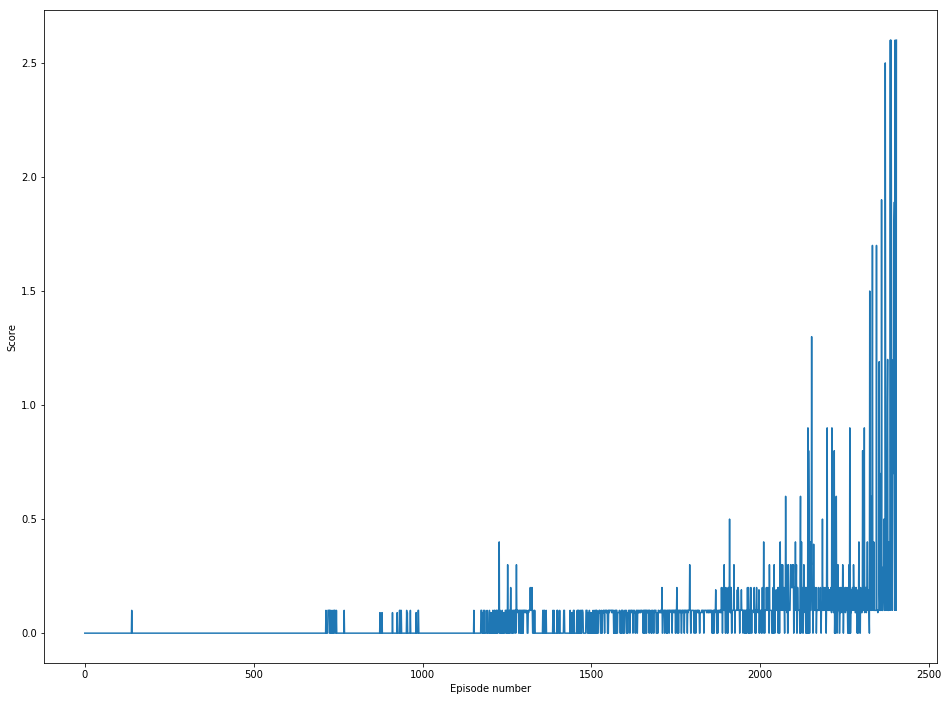

[//]: # (Image References)

[image1]: https://miro.medium.com/max/600/1*UmQHDskrYnONpVFk-1TjZA.gif "Trained Agents"

# Project 3 - Collaboration and Competition
## Teaching 2 Agents to play Tennis

### 1. Introduction

In this environment, two agents control rackets to bounce a ball over a net. If an agent hits the ball over the net, it receives a ***reward of +0.1***. If an agent lets a ball hit the ground or hits the ball out of bounds, it receives a ***reward of -0.01***. Thus, the goal of each agent is to keep the ball in play.

- The ***observation space*** consists of 24 variables representing position and velocity of ball and tennis racket. 
- Each ***action*** is vector of length 2 : movement towards or away from net and jumping. Each member of this vector is a number between -1 and 1.

The task is episodic, and in order to solve the environment, **the agents must get an average score of +0.5 (over 100 consecutive episodes, after taking the maximum over both agents)**. Specifically,

- After each episode, we add up the rewards that each agent received (without discounting), to get a score for each agent. This yields 2 (potentially different) scores. We then take the maximum of these 2 scores.
- This yields a single **score** for each episode.

The environment is considered solved, when the average (over 100 episodes) of those **scores is at least +0.5.**

![Trained Agents][image1]

### 2. Implementation

#### 2.1 Learning Algorithm
1. In this implementation we use **Multi Agent Deep Deterministic Policy Gradient (MADDPG)** as the learning algorithm. MADDPG find its origins in an *off-policy method* called **Deep Deterministic Policy Gradient (DDPG)** and described in the paper [Continuous control with deep reinforcement learning](https://arxiv.org/abs/1509.02971).
2. Why MADDPG?
- Traditional algorithms in the multi-agent case: Q-learning is challenged by an inherent non-stationarity of the environment, while policy gradient suffers from a variance that increases as the number of agents grows
- An adaptation of actor-critic methods considers action policies of other agents and is able to successfully learn policies that require complex multi-agent coordination

3. We introduce a training regimen utilizing an ensemble of policies for each agent that leads to more robust multi-agent policies. We show the strength of our approach compared to existing methods in cooperative as well as competitive scenarios, where agent populations are able to discover various physical and informational coordination strategies.
4. The main difference is that all agents share the same replay buffer - reason being agent may get caught in a tight loop of specific states that loop back through one another and detract from the agent being able to explore the complete environment equally. By sharing replay buffer, we ensure complete exploration of the environment.
5. **Hyperparameters**

- We have two models for each agent: Actor and Critic, hence we have 2 sets of weights that need to be optimized separately

| Model     | Hyperparameter                   | Value         |
| --------- | -------------------------------- | ------------- |
| Actor     | Architecture                     | [128 , 64]    |
| Actor     | Optimizer - Type                 | Adam          |
| Actor     | Optimizer - Betas                | [0.9, 0.999]  |
| Actor     | Optimizer - Learning rate        | 1e-4          |
| Actor     | Optimizer - Epsilon              | 1e-7          |
| Critic    | Architecture                     | [128 , 64]    |
| Critic    | Optimizer - Type                 | Adam          |
| Critic    | Optimizer - Betas                | [0.9, 0.999]  |
| Critic    | Optimizer - Learning rate        | 1e-3          |
| Critic    | Optimizer - Epsilon              | 1e-7          |
| Q         | Gamma (discount factor)          | 0.99          |
|           | Soft Target Update - Tau         | 1e-3          |
|           | Replay buffer size               | 10e6          |
|           | Batch size                       | 128           |
|           | Number of episodes               | 15000         |
|           | Leak for LeakyReLU               | 0.01          |

- For critic the actions are included in 1st hidden layer of Q. 
- The final layer weights and biases of both the actor abd critic were initialized from a uniform distribution [ -3e3, 3e3] to ensure that initial policy outputs and value estimates are near 0. 

### 3. Results

The agents are trained until they obtain an average reward of atleast +0.5 over past 100 episodes. Given the chosen architecture and hyperparameters, plot of the rewards across episodes is shown below:
 

Our implementation solved the environment in **2304 episodes**!
### 4. Further Improvements

1. As presented on [OpenAI](https://openai.com/)'s [Spinning Up](https://spinningup.openai.com/en/latest/index.html) website, trying the **Twin Delayed DDPG (TD3)** algorithm is a good avenue for improving our Multi Agents environments.
See :[Twin Delayed DDPG (TD3)](https://spinningup.openai.com/en/latest/algorithms/td3.html)
2. We can use prioritised experience buffer. https://github.com/Damcy/prioritized-experience-replay
3. Use parameter space noise rather than noise on action. https://vimeo.com/252185862 https://github.com/jvmancuso/ParamNoise
4. Different replay buffer for actor/critic
5. Try adding dropouts in critic network
